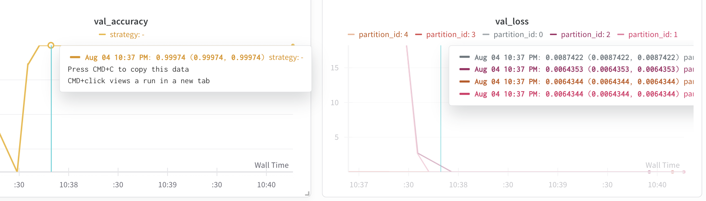

# simple-linear-regression: A Flower / PyTorch app

## Install dependencies and project

The dependencies are listed in the `pyproject.toml` and you can install them as follows:

```bash
pip install -e .
```

> **Tip:** Your `pyproject.toml` file can define more than just the dependencies of your Flower app. You can also use it to specify hyperparameters for your runs and control which Flower Runtime is used. By default, it uses the Simulation Runtime, but you can switch to the Deployment Runtime when needed.
> Learn more in the [TOML configuration guide](https://flower.ai/docs/framework/how-to-configure-pyproject-toml.html).

## Run with the Simulation Engine

In the `simple-linear-regression` directory, use `flwr run` to run a local simulation:

```bash
flwr run .
```

Refer to the [How to Run Simulations](https://flower.ai/docs/framework/how-to-run-simulations.html) guide in the documentation for advice on how to optimize your simulations.


# Optimization

In this simple linear regression Flower app, optimization refers to the process of adjusting the model parameters (weights and bias) to minimize the loss function, typically Mean Squared Error (MSE), between the predicted and actual values. This is achieved using stochastic gradient descent (SGD) or similar optimizers provided by PyTorch.

During each round of federated learning, clients train their local models on their own data using the optimizer. The optimizer updates the model parameters by computing gradients of the loss with respect to the parameters and taking steps in the direction that reduces the loss. After local training, the updated parameters are sent to the server, which aggregates them (e.g., by averaging) to form a new global model. This process repeats for several rounds, gradually improving the model's performance.

Key points about optimization in this project:

- **Loss Function:** Mean Squared Error (MSE) is used to measure the difference between predictions and true values.
- **Optimizer:** PyTorch's SGD or Adam optimizers are commonly used to update model parameters.
- **Federated Averaging:** The server aggregates model updates from all clients to produce a new global model.
- **Hyperparameters:** Learning rate, number of local epochs, and batch size can be tuned in `pyproject.toml` to optimize training.

For more details on optimization strategies and best practices, refer to the [Flower documentation](https://flower.ai/docs/framework/how-to-run-simulations.html).


