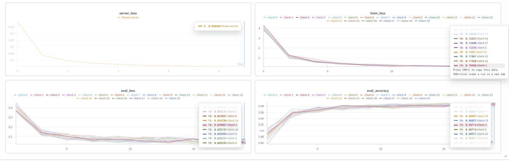

# distributed-minst: A Flower / PyTorch app

## Overview

This project implements federated learning for MNIST digit classification using Flower and PyTorch. Data is partitioned IID across clients, each training locally and sharing updates with a central server. The server coordinates rounds of training, aggregates model updates, and evaluates global performance. The code is modular, with separate scripts for client logic, server orchestration, task definitions, and data utilities. Training progress is saved in checkpoints and visualized for performance tracking.

### Main Files in `distributed_minst/`

| File | Description |
|------|-------------|
| client_app.py | Flower client for MNIST classification. Handles local training and communication with the server. |
| server_app.py | Flower server for federated training. Orchestrates rounds and aggregates client updates. |
| task.py | Defines federated learning tasks and workflow. |
| minst_hdf5.py | Utilities for loading and managing MNIST data in HDF5 format. |
| __init__.py | Package initializer. |

Wandb training progress report is below.

https://wandb.ai/vadhri-venkat/distributed-minst/reports/Distributed-minst-using-federation-learning--VmlldzoxMzg3ODQ4NA

## Install dependencies and project

The dependencies are listed in the `pyproject.toml` and you can install them as follows:

```bash
pip install -e .
```

> **Tip:** Your `pyproject.toml` file can define more than just the dependencies of your Flower app. You can also use it to specify hyperparameters for your runs and control which Flower Runtime is used. By default, it uses the Simulation Runtime, but you can switch to the Deployment Runtime when needed.
> Learn more in the [TOML configuration guide](https://flower.ai/docs/framework/how-to-configure-pyproject-toml.html).

## Run with the Simulation Engine

In the `distributed-minst` directory, use `flwr run` to run a local simulation:

```bash
flwr run .
```

Refer to the [How to Run Simulations](https://flower.ai/docs/framework/how-to-run-simulations.html) guide in the documentation for advice on how to optimize your simulations.

## Run with the Deployment Engine

Follow this [how-to guide](https://flower.ai/docs/framework/how-to-run-flower-with-deployment-engine.html) to run the same app in this example but with Flower's Deployment Engine. After that, you might be interested in setting up [secure TLS-enabled communications](https://flower.ai/docs/framework/how-to-enable-tls-connections.html) and [SuperNode authentication](https://flower.ai/docs/framework/how-to-authenticate-supernodes.html) in your federation.

You can run Flower on Docker too! Check out the [Flower with Docker](https://flower.ai/docs/framework/docker/index.html) documentation.


## Training Progress Showcase



## Resources

- Flower website: [flower.ai](https://flower.ai/)
- Check the documentation: [flower.ai/docs](https://flower.ai/docs/)
- Give Flower a ⭐️ on GitHub: [GitHub](https://github.com/adap/flower)
- Join the Flower community!
  - [Flower Slack](https://flower.ai/join-slack/)
  - [Flower Discuss](https://discuss.flower.ai/)
